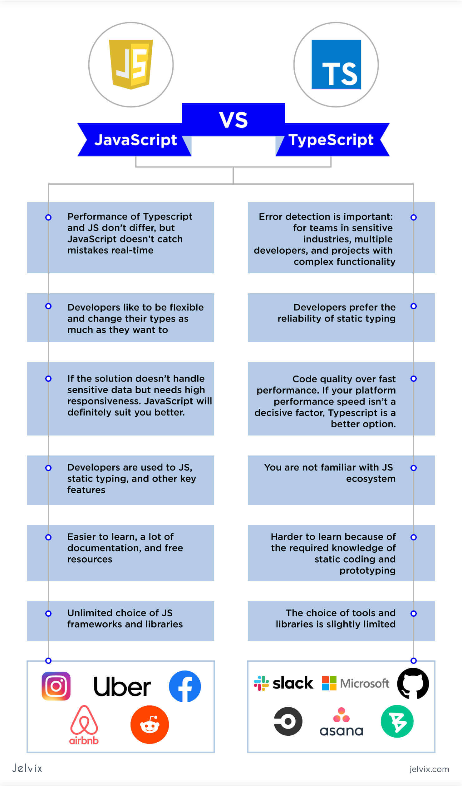
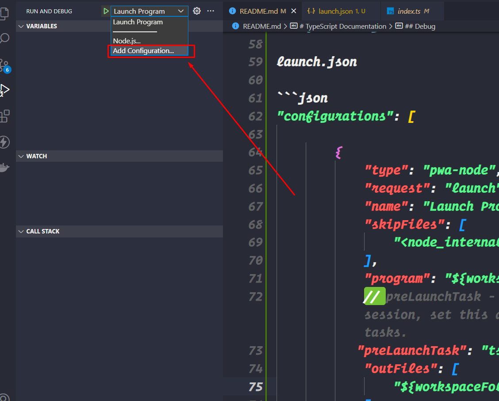

# TypeScript Documentation

> A programming language to address shortcoming of javascript



- Statically Typed

```c++
int number = 10;
number = "string" ❌ // it's not possible in Statically typed language
```

- Dynamically Typed

```js
let number = 10;
number = "string"; // it's possible in Dynamically typed language

// The problem occur when we want to do some operation with
let result = number + 5;
```

- TypeScript

```ts
let number = 10;
number = "string" ❌ // it's not possible in TypeScript
```

## Setup

```ts
npm install -g typescript // install typescript globally
tsc --init // creates a tsconfig.json file


tsc // transpile every file in the current directory
tsc index.ts // transpile a specific file
tsc --watch // transpile on change in current directory (watch changes)
```

- tsconfig.json

```json
"target": "es2016",    // Set the JavaScript language version for emitted JavaScript and include compatible library declarations.
"module": "commonjs",  // Specify what module code is generated.
"rootDir": "./src",   // Specify the root folder within your source files.
"outDir": "./dist", // Specify an output folder for all emitted files.
"removeComments": true, // Disable emitting comments.
"noEmitOnError": true, // Disable emitting files if any type checking errors are reported.
"sourceMap": true, // Create source map files for emitted JavaScript files. A source map file maps from the transpiled JavaScript file to the original TypeScript file. This allows the original TypeScript code to be reconstructed while debugging.

"noUnusedParameters": true, // Raise an error when a function parameter isn't read.
"noUnusedLocals": true, // Enable error reporting when local variables aren't read. 
"noImplicitReturns": true, // Enable error reporting for codepaths that do not explicitly return in a function.

```

## Debug

> Before debug we can create or edit launch.json file


<br>
launch.json

```json
"configurations": [

        {
            "type": "pwa-node",
            "request": "launch",
            "name": "Launch Program",
            "skipFiles": [
                "<node_internals>/**"
            ],
            "program": "${workspaceFolder}\\src\\index.ts",
            // preLaunchTask - to launch a task before the start of a debug session, set this attribute to the label of a task specified in tasks.
           "preLaunchTask": "tsc: build - tsconfig.json",
            "outFiles": [
                "${workspaceFolder}/**/*.js"
            ]
        }
    ]
```

## Data Type

#### Javascript

- number
- string
- boolean
- null
- undefined
- object

#### TypeScript

- any
- unknown
- never
- enum
- tuple
