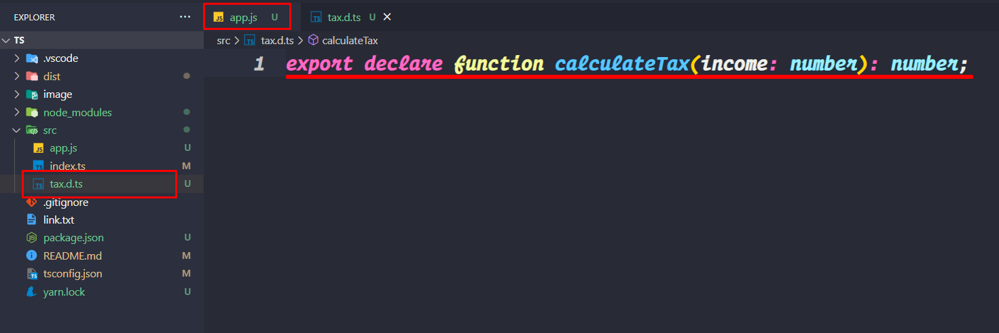

# TypeScript Documentation

> A programming language to address shortcoming of javascript


- Statically Typed

```c++
int number = 10;
number = "string" ❌ // it's not possible in Statically typed language
```

- Dynamically Typed

```js
let number = 10;
number = "string"; // it's possible in Dynamically typed language

// The problem occur when we want to do some operation with
let result = number + 5;
```

- TypeScript

```ts
let number = 10;
number = "string" ❌ // it's not possible in TypeScript
```

## Setup

```ts
npm install -g typescript // install typescript globally
tsc --init // creates a tsconfig.json file


tsc // transpile every file in the current directory
tsc index.ts // transpile a specific file
tsc --watch // transpile on change in current directory (watch changes)
```

- tsconfig.json

```json
"target": "es2016",    // Set the JavaScript language version for emitted JavaScript and include compatible library declarations.
"module": "commonjs",  // Specify what module code is generated.
"rootDir": "./src",   // Specify the root folder within your source files.
"outDir": "./dist", // Specify an output folder for all emitted files.
"removeComments": true, // Disable emitting comments.
"noEmitOnError": true, // Disable emitting files if any type checking errors are reported.
"sourceMap": true, // Create source map files for emitted JavaScript files. A source map file maps from the transpiled JavaScript file to the original TypeScript file. This allows the original TypeScript code to be reconstructed while debugging.

"noUnusedParameters": true, // Raise an error when a function parameter isn't read.
"noUnusedLocals": true, // Enable error reporting when local variables aren't read.
"noImplicitReturns": true, // Enable error reporting for codepaths that do not explicitly return in a function.
"allowUnreachableCode": false, // Disable error reporting for unreachable code.

 /* JavaScript Support */
"allowJs": true, // Allow JavaScript files to be a part of your program. Use the 'checkJS' option to get errors from these files.
"checkJs": true, // Enable error reporting in type-checked JavaScript files.
```

## Debug

> Before debug we can create or edit launch.json file


<br>
launch.json

```json
"configurations": [

        {
            "type": "pwa-node",
            "request": "launch",
            "name": "Launch Program",
            "skipFiles": [
                "<node_internals>/**"
            ],
            "program": "${workspaceFolder}\\src\\index.ts",
            // preLaunchTask - to launch a task before the start of a debug session, set this attribute to the label of a task specified in tasks.
           "preLaunchTask": "tsc: build - tsconfig.json",
            "outFiles": [
                "${workspaceFolder}/**/*.js"
            ]
        }
    ]
```

## Data Type

#### Javascript

- number
- string
- boolean
- null
- undefined
- object

#### TypeScript

- any
- unknown
- array
- tuples
- never
- enum

##### Tuples

Tuples are fixed-length arrays where each element has a specific type.The number of elements of the array is fixed. The type of the elements is known. The type of the elements of the array need not be the same

```ts
let user: [number, string] = [1, "rasel"];
```

##### Enum

Each of these constant values is known as a member of the enum. Enums are useful when setting properties or values that can only be a certain number of possible values.

```ts
const enum Size {
  Small = "Small",
  Medium = "Medium",
  Large = "Large",
}
// Access the value
console.log(Size.Small);
```

##### Object Read Only Property

```ts
const users: {
  readonly id: number,
  name: string
} = {
  id: 1,
  name: "Rasel"
}

// Cannot assign to 'id' because it is a read-only property.
users.id = 5 ❌
```

#### Union

```ts
type role = "admin" | "super-admin" | "user";
```

#### Intersection

An intersection type creates a new type by combining multiple existing types. The new type has all features of the existing types. To combine types, you use the & operator as follows: type typeAB = typeA & typeB;

```ts
type isBoolean = {
  checkIsBoolean: () => boolean;
};

type isNumber = {
  checkIsNumber: () => boolean;
};
const checkStuff: isBoolean & isNumber = {
  checkIsBoolean() {
    return true;
  },
  checkIsNumber() {
    return true;
  },
};
```

#### Type Assertions

Type assertions are, simply put, evil. They are meant to tell the compiler: "I know what I am doing, and I know it better than you". Frankly, most of the time, developers do not know better than the compiler. So unless there is a really good reason, do not use type assertions

```ts
let phone = document.getElementById("emailInput") as HTMLInputElement;
// or
let phone2 = <HTMLInputElement>document.getElementById("emailInput");

console.log(phone.value);
```


## OOP IN Typescript

### Creating a Class

```ts
class Account {
    id: number;
    owner: string;
    balance: number

    constructor(id: number, owner: string, balance: number) {
        this.id = id;
        this.owner = owner;
        this.balance = balance
    }
    deposit(amount: number) {
        if (amount <= 0)
            throw new Error("Invalid amount")
        this.balance += amount
    }
}

const account = new Account(1, "Rasel", 500)
console.log(account instanceof Account)
```


#### Index Signature Property

```ts
// const person = {}
// person.id = "rasel" // it's not valid in typescript

// So that . we cna create an class . and from the class we can create obj
class SeatPerson {
    // index  signature property
    [seatPerson: string]: string
}

const seats = new SeatPerson()
seats.first = "Rasel"
seats.last = "Hossain"
seats.age = 50 ❌ // we also use type
console.log(seats)
```

### Declaration File



```js
app.js;

/**
 * Calculate income tax
 * @param {number} income - Net salary after expenses
 * @returns {number}
 */
export function calculateTax(income) {
  return income * 0.3;
}
```

```ts
tax.d.ts;
export declare function calculateTax(income: number): number;
```

## Generic

What are Generics?

Generics have been a major feature of strongly typed languages
like Java and C#. In TypeScript, they allow the types of components
and functions to be "SPECIFIED LATER" which allows them to be used
in creating reusable components that can apply to different use cases,

TypeScript Generics is a tool which provides a way to create reusable components. It creates a component that can work with a variety of data types rather than a single data type. It allows users to consume these components and use their own types.

Generics allow creating 'type variables' which can be used to create classes, functions & type aliases that don't need to explicitly define the types that they use. Generics makes it easier to write reusable code.

- Generic Classes
- Generic Functions
- Generic Interfaces
- Generic Constraints
- Type Mapping

### Generic Classes

```ts
class KeyValuePair<Tkey, TValue> {
  constructor(public key: Tkey, public value: TValue) {}
}

const pair1 = new KeyValuePair<number, string>(1, "Rasel");
const pair2 = new KeyValuePair<string, string>("1", "Rasel");
// it's automatic infer
const pair3 = new KeyValuePair(5, "hossain");

console.log(pair1, pair2, pair3);
```

## Generic Function

```ts
const testFunc = <TValue>(value: TValue) => {
  return value;
};
testFunc<number>(5);
testFunc("Rasel"); // it's automatic infer

// In class
class Utils {
  static createArray<TValue>(value: TValue) {
    return [value];
  }
}

Utils.createArray<number>(5);
Utils.createArray("Rasel");
```

## Rect Typescript

<a hrf="https://react-typescript-cheatsheet.netlify.app/docs/basic/getting-started/function_components"><b>React Typescript Cheat sheet 😎</b></a>
